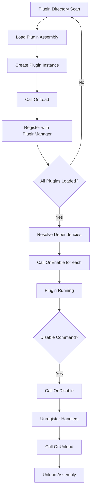

# AeroScape Plugin Architecture Design

## Overview

This document outlines the plugin system architecture for AeroScape Server, transforming it from a monolithic structure into a modular, plugin-based system similar to Minecraft Bukkit/Spigot.

## Core Design Principles

1. **Everything is a plugin** - All game content (skills, combat, minigames, etc.) should be loadable as plugins
2. **Hot-reload capable** - Plugins can be loaded/unloaded without server restart
3. **Event-driven** - Plugins interact with core through events, not direct coupling
4. **API-first** - Clean separation between core API and plugin implementations
5. **Sandboxed** - Plugins have controlled access to server internals

## Project Structure

```
AeroScape.Server/
├── AeroScape.Server.API/              # New: Plugin API interfaces
│   ├── IPlugin.cs
│   ├── IPluginAPI.cs
│   ├── Events/
│   │   ├── IEventAPI.cs
│   │   ├── PlayerEvents.cs
│   │   ├── WorldEvents.cs
│   │   └── PacketEvents.cs
│   ├── Services/
│   │   ├── IPlayerAPI.cs
│   │   ├── IWorldAPI.cs
│   │   ├── IItemAPI.cs
│   │   └── IPacketAPI.cs
│   └── Models/                        # DTOs for plugin use
│       ├── PlayerInfo.cs
│       ├── ItemInfo.cs
│       └── LocationInfo.cs
│
├── AeroScape.Server.PluginHost/       # New: Plugin loading/management
│   ├── PluginManager.cs
│   ├── PluginLoader.cs
│   ├── PluginContext.cs
│   └── EventDispatcher.cs
│
├── AeroScape.Server.Core/             # Modified: Core server (slimmed down)
│   ├── Entities/                      # Internal entities (not exposed to plugins)
│   ├── Handlers/                      # Packet handlers dispatch to plugins
│   └── Services/                      # Core services implement plugin APIs
│
├── plugins/                           # Plugin directory (runtime)
│   ├── Woodcutting/
│   │   ├── Woodcutting.dll
│   │   ├── plugin.yml
│   │   └── config.yml
│   └── Mining/
│       ├── Mining.dll
│       └── plugin.yml
│
└── Plugins/                           # Plugin source projects
    ├── AeroScape.Plugin.Woodcutting/
    │   ├── WoodcuttingPlugin.cs
    │   ├── TreeDefinitions.cs
    │   └── plugin.yml
    └── AeroScape.Plugin.Mining/
        └── MiningPlugin.cs
```

## Core Interfaces

### IPlugin - Base Plugin Interface

```csharp
namespace AeroScape.Server.API;

public interface IPlugin
{
    /// <summary>Plugin metadata</summary>
    PluginInfo Info { get; }
    
    /// <summary>Called when plugin is loaded into memory</summary>
    void OnLoad(IPluginAPI api);
    
    /// <summary>Called when plugin is enabled (after all plugins loaded)</summary>
    void OnEnable();
    
    /// <summary>Called when plugin is being disabled</summary>
    void OnDisable();
    
    /// <summary>Called when plugin is being unloaded from memory</summary>
    void OnUnload();
}

public class PluginInfo
{
    public string Name { get; init; }
    public string Version { get; init; }
    public string Author { get; init; }
    public string Description { get; init; }
    public string[] Dependencies { get; init; } = Array.Empty<string>();
}
```

### IPluginAPI - Main API Surface

```csharp
namespace AeroScape.Server.API;

public interface IPluginAPI
{
    /// <summary>Event system for hooking game events</summary>
    IEventAPI Events { get; }
    
    /// <summary>Player management and queries</summary>
    IPlayerAPI Players { get; }
    
    /// <summary>World and object interactions</summary>
    IWorldAPI World { get; }
    
    /// <summary>Item definitions and management</summary>
    IItemAPI Items { get; }
    
    /// <summary>Packet sending and interception</summary>
    IPacketAPI Packets { get; }
    
    /// <summary>Plugin configuration management</summary>
    IConfigAPI Config { get; }
    
    /// <summary>Scheduled task execution</summary>
    ISchedulerAPI Scheduler { get; }
    
    /// <summary>Logging for this plugin</summary>
    ILogger Logger { get; }
}
```

### IEventAPI - Event System

```csharp
namespace AeroScape.Server.API.Events;

public interface IEventAPI
{
    /// <summary>Register an event handler</summary>
    void RegisterHandler<TEvent>(EventHandler<TEvent> handler, EventPriority priority = EventPriority.Normal) 
        where TEvent : EventArgs;
    
    /// <summary>Unregister an event handler</summary>
    void UnregisterHandler<TEvent>(EventHandler<TEvent> handler) 
        where TEvent : EventArgs;
}

public enum EventPriority
{
    Lowest = 0,
    Low = 1,
    Normal = 2,
    High = 3,
    Highest = 4,
    Monitor = 5  // Read-only, cannot modify event
}

// Example events
public class PlayerInteractObjectEventArgs : CancellableEventArgs
{
    public PlayerInfo Player { get; init; }
    public int ObjectId { get; init; }
    public LocationInfo Location { get; init; }
}

public class PlayerSkillXPEventArgs : CancellableEventArgs
{
    public PlayerInfo Player { get; init; }
    public int SkillId { get; init; }
    public double XPAmount { get; set; }  // Modifiable
}
```

### IPlayerAPI - Player Management

```csharp
namespace AeroScape.Server.API.Services;

public interface IPlayerAPI
{
    /// <summary>Get player by username</summary>
    PlayerInfo? GetPlayer(string username);
    
    /// <summary>Get all online players</summary>
    IReadOnlyList<PlayerInfo> GetOnlinePlayers();
    
    /// <summary>Send message to player</summary>
    void SendMessage(PlayerInfo player, string message);
    
    /// <summary>Add item to player inventory</summary>
    bool AddItem(PlayerInfo player, int itemId, int amount = 1);
    
    /// <summary>Get player skill level</summary>
    int GetSkillLevel(PlayerInfo player, int skillId);
    
    /// <summary>Add skill XP to player</summary>
    void AddSkillXP(PlayerInfo player, int skillId, double xp);
    
    /// <summary>Play animation for player</summary>
    void PlayAnimation(PlayerInfo player, int animationId, int delay = 0);
}
```

## Plugin Lifecycle



## Plugin Discovery & Loading

### Directory Structure
```
plugins/
├── Woodcutting/
│   ├── Woodcutting.dll          # Main plugin assembly
│   ├── plugin.yml               # Plugin metadata
│   ├── config.yml               # Default configuration
│   └── libs/                    # Plugin-specific dependencies
│       └── TreeDatabase.dll
```

### plugin.yml Format
```yaml
name: Woodcutting
main: AeroScape.Plugin.Woodcutting.WoodcuttingPlugin
version: 1.0.0
author: AeroScape Team
description: Woodcutting skill implementation
dependencies: []  # Other plugin names this depends on
api-version: 1.0  # Minimum API version required
```

### Assembly Loading Strategy

Use `AssemblyLoadContext` for isolation and hot-reload:

```csharp
public class PluginLoadContext : AssemblyLoadContext
{
    public PluginLoadContext(string pluginPath) : base(isCollectible: true)
    {
        // Enable unloading for hot-reload
    }
    
    protected override Assembly? Load(AssemblyName assemblyName)
    {
        // Custom resolution logic for plugin dependencies
    }
}
```

## Example: Woodcutting Plugin

### Plugin Implementation

```csharp
namespace AeroScape.Plugin.Woodcutting;

public class WoodcuttingPlugin : IPlugin
{
    private IPluginAPI _api;
    private TreeDefinitions _trees;
    private Dictionary<string, WoodcuttingSession> _sessions = new();
    
    public PluginInfo Info => new()
    {
        Name = "Woodcutting",
        Version = "1.0.0",
        Author = "AeroScape Team",
        Description = "Woodcutting skill implementation"
    };
    
    public void OnLoad(IPluginAPI api)
    {
        _api = api;
        _trees = new TreeDefinitions();
        
        // Load configuration
        var config = _api.Config.Load();
        _trees.LoadFromConfig(config);
    }
    
    public void OnEnable()
    {
        // Register event handlers
        _api.Events.RegisterHandler<PlayerInteractObjectEventArgs>(OnPlayerInteractObject);
        _api.Events.RegisterHandler<PlayerTickEventArgs>(OnPlayerTick);
        
        _api.Logger.Info("Woodcutting plugin enabled!");
    }
    
    public void OnDisable()
    {
        // Clean up active sessions
        _sessions.Clear();
    }
    
    public void OnUnload()
    {
        // Final cleanup
    }
    
    private void OnPlayerInteractObject(object sender, PlayerInteractObjectEventArgs e)
    {
        // Check if object is a tree
        var tree = _trees.GetTree(e.ObjectId);
        if (tree == null) return;
        
        // Check player level
        var wcLevel = _api.Players.GetSkillLevel(e.Player, SkillIds.Woodcutting);
        if (wcLevel < tree.RequiredLevel)
        {
            _api.Players.SendMessage(e.Player, $"You need level {tree.RequiredLevel} Woodcutting to chop this tree.");
            e.Cancel = true;
            return;
        }
        
        // Start woodcutting session
        _sessions[e.Player.Username] = new WoodcuttingSession
        {
            Player = e.Player,
            Tree = tree,
            StartTime = DateTime.UtcNow
        };
        
        _api.Players.PlayAnimation(e.Player, tree.ChopAnimation);
        _api.Players.SendMessage(e.Player, "You swing your axe at the tree.");
        
        e.Cancel = true; // Prevent default handling
    }
    
    private void OnPlayerTick(object sender, PlayerTickEventArgs e)
    {
        if (!_sessions.TryGetValue(e.Player.Username, out var session))
            return;
            
        // Process woodcutting logic...
    }
}
```

## Migration Plan: Core → Plugin

### Phase 1: Create Plugin Infrastructure
1. Create `AeroScape.Server.API` project with all interfaces
2. Create `AeroScape.Server.PluginHost` project with plugin management
3. Implement plugin loading and event system in Core

### Phase 2: Extract Woodcutting
1. Create `AeroScape.Plugin.Woodcutting` project
2. Move `WoodcuttingSkill.cs` logic to plugin
3. Replace direct object handling with event-based approach
4. Move tree definitions to plugin configuration

### Phase 3: Core Modifications
1. Remove `WoodcuttingSkill` from Core
2. Modify `ObjectOption1MessageHandler` to fire events instead of direct handling
3. Create API implementations in Core that delegate to internal services
4. Add plugin initialization to server startup

### Phase 4: Testing & Validation
1. Verify woodcutting works identically as a plugin
2. Test hot-reload capability
3. Benchmark performance impact
4. Document plugin development process

## Database Access Strategy

Plugins should NOT have direct database access. Instead:

1. **Read Access**: Via API methods that return DTOs
   ```csharp
   var playerStats = _api.Players.GetStats(player);
   var itemDef = _api.Items.GetDefinition(itemId);
   ```

2. **Write Access**: Via API methods with validation
   ```csharp
   _api.Players.SaveData(player, "woodcutting.total_logs", totalLogs);
   ```

3. **Plugin Storage**: Key-value store per plugin
   ```csharp
   await _api.Storage.SetAsync("high_scores", highScoreList);
   var scores = await _api.Storage.GetAsync<List<Score>>("high_scores");
   ```

## Security Considerations

1. **API Boundaries**: Plugins cannot access internal `Player` entity, only `PlayerInfo` DTO
2. **Resource Limits**: CPU/memory monitoring per plugin
3. **Permission System**: Optional permissions for sensitive operations
4. **Sandboxing**: Each plugin runs in its own AssemblyLoadContext
5. **Event Validation**: Core validates all event modifications

## Performance Considerations

1. **Event Overhead**: Use async events for non-critical paths
2. **Caching**: Plugin API can cache frequently accessed data
3. **Batch Operations**: API methods for bulk operations
4. **Lazy Loading**: Plugins loaded on-demand, not all at startup

## Configuration System

Each plugin gets:
- `plugin.yml` - Metadata (not modifiable)
- `config.yml` - Default configuration (copied on first run)
- `data/` folder - Runtime data storage

```csharp
// Plugin config access
var config = _api.Config.Load();
var treeRespawnTime = config.GetInt("trees.respawn_time", 60);

// Save config changes
config.Set("trees.respawn_time", 120);
_api.Config.Save(config);
```

## Future Enhancements

1. **Plugin Dependencies**: Load order based on dependency graph
2. **Plugin Repository**: Central repository for downloading plugins
3. **Version Management**: Handle plugin updates gracefully
4. **Inter-Plugin Communication**: Plugins can expose services to each other
5. **Web UI**: Admin panel for plugin management
6. **Scripting Support**: Allow lightweight plugins in C# scripts or Lua

## Risks and Mitigations

| Risk | Impact | Mitigation |
|------|--------|------------|
| Performance overhead from events | High | Benchmark critical paths, use async where possible |
| Plugin crashes affecting server | High | Exception isolation, automatic disable on repeated crashes |
| API versioning complexity | Medium | Semantic versioning, deprecation warnings |
| Security vulnerabilities in plugins | High | Sandboxing, permission system, code signing |
| Memory leaks from hot-reload | Medium | Proper AssemblyLoadContext disposal, memory monitoring |
| Database consistency | High | All DB writes through validated API methods |
| Plugin conflicts | Medium | Namespace isolation, event priority system |